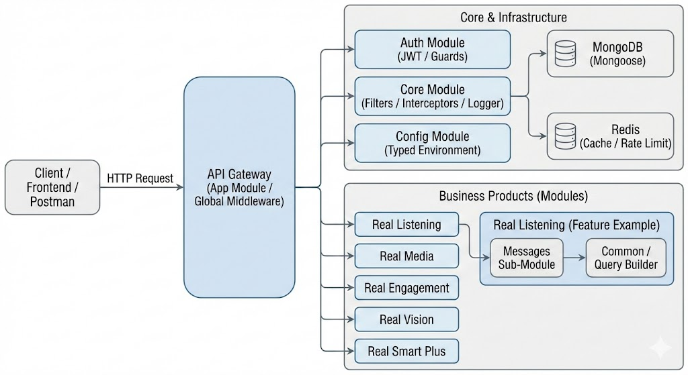

<p align="center">
  <a href="http://nestjs.com/" target="blank"></a>
</p>

  <p align="center">A progressive <a href="http://nodejs.org" target="_blank">Node.js</a> framework for building efficient and scalable server-side applications.</p>
    <p align="center">

# 🚀 RealOne (Backend)

โปรเจกต์นี้คือระบบ Backend สำหรับแพลตฟอร์ม Real Smart Product (Revamped version) ซึ่งถูกยกระดับสถาปัตยกรรมจาก Node.js/Express เดิม มาเป็น **NestJS** เพื่อรองรับการขยายตัวของระบบ (Scalability), บังคับใช้โครงสร้างที่เป็นมาตรฐานระดับองค์กร (Enterprise-grade Architecture), และเพิ่มความปลอดภัยในการเขียนโค้ดด้วย Type-Safety (TypeScript)

---

## 🏗️ Architecture & Diagram (สถาปัตยกรรมของระบบ)

ระบบถูกออกแบบด้วยแนวคิด **Modular Monolith** โดยแบ่งแยก **Business Logic** ของแต่ละ Product (เช่น **_Real Listening_**, **_Real Media_**, **_Real Engagement_**) ออกจากกันอย่างชัดเจน เพื่อให้ง่ายต่อการดูแลรักษา ป้องกันโค้ดพันกัน (Spaghetti Code) และเตรียมพร้อมสำหรับการแยกย้ายเป็น Microservices ในอนาคต



## 📂 Project Structure (คำอธิบายโครงสร้างโฟลเดอร์)

โครงสร้างโฟลเดอร์ถูกจัดวางตาม NestJS Best Practices โดยแบ่งเป็นส่วนหลักๆ ดังนี้:

1. src/core/ (หัวใจหลักของระบบ)
   ส่วนนี้เก็บกลไก (Cross-cutting concerns) ที่ทุกๆ Module ในแอปพลิเคชันต้องใช้ร่วมกัน:

- **database/:** จัดการการเชื่อมต่อ Mongoose และ Repository พื้นฐาน

- **filters/:** ดักจับ Error ทั่วทั้งระบบ (Global Exception Filter) เพื่อให้ Response รูปแบบเดียวกันเสมอ

- **interceptors/:** แปลงรูปแบบข้อมูล Response ขาออก หรือทำระบบ Logging กลาง

- **middleware/:** จัดการ Request ก่อนเข้าสู่ Controller (เช่น การแนบ Request-ID เพื่อตามรอย Log)

- **rate-limit/:** ระบบป้องกันการยิง API ซ้ำๆ (DDos / Spam Protection)

2. src/config/ (การจัดการ Configuration) ใช้หลักการ Typed Configuration เพื่อป้องกันข้อผิดพลาดจากการตั้งค่า .env ตกหล่น:

- มีการแยกไฟล์ Config ตามหมวดหมู่ เช่น database.config.ts, auth.config.ts เพื่อความสะอาดตา

- มี env.schema.ts สำหรับ Validate ตัวแปร Environment แบบเข้มงวดก่อน Start Server

3. src/auth/ (ระบบรักษาความปลอดภัย) จัดการเรื่อง Authentication ด้วย JWT (JSON Web Token)

- มี jwt-auth.guard.ts สำหรับปกป้อง Route ต่างๆ และ @Public() decorator สำหรับเปิดทางให้ Route ที่ไม่ต้อง Login

4. src/modules/ (Business Logic / Products) ส่วนนี้คือ Product ย่อยต่างๆ ของระบบ แต่ละ Product จะแยกทำงานเป็นอิสระต่อกัน (Vertical Slicing):

- real-listening/: แพลตฟอร์ม Social Listening ใช้รูปแบบ Sub-module pattern (เช่น แยกย่อยเป็น features/messages) มี SocialQueryBuilderService เป็นศูนย์กลางแปลง DTO เป็น MongoDB Query Pipeline

- real-engagement/, real-vision/, real-smart-plus/: โมดูลสำหรับ Product อื่นๆ

5. src/platform/ (Integration & Infrastructure)
   queue/: ใช้สำหรับจัดการ Background Jobs หรือ Message Queue รองรับการประมวลผลข้อมูลปริมาณมหาศาลแบบ Asynchronous

## 🛠️ Tech Stack

**Framework:** NestJS (Node.js)

**Language:** TypeScript

**Database:** MongoDB (via Mongoose)

**Validation:** class-validator & class-transformer (Strict Payload Checking)

**Documentation:** Swagger / OpenAPI

**Date Manipulation:** Day.js

## 🚀 Getting Started (การรันโปรเจกต์)

1. การติดตั้ง (Installation)

   ```bash
   $ npm install
   ```

2. ตั้งค่า Environment Variables
   คัดลอกไฟล์ต้นแบบ (เช่น .env.example) ไปเป็น .env และกำหนดค่าที่จำเป็น เช่น:

ข้อมูลโค้ด
PORT=3000
MONGO_URI=mongodb://127.0.0.1:27017/social_db
JWT_SECRET=your_super_secret_key
MONGO_CONNECT_DELAY=0 # กำหนดเป็น 0 ในช่วง Development เพื่อให้ Start ได้รวดเร็ว 3. การรันแอปพลิเคชัน (Running the app)
Bash

## development mode

```bash
$ npm run start
```

## watch mode (สำหรับตอนเขียนโค้ด - แนะนำ)

```bash
$ npm run start:dev
```

## production mode

```bash
$ npm run start:prod
```

## 📚 API Documentation (Swagger)

เมื่อ Start Server เสร็จสิ้น สามารถดู API Documentation และทดสอบยิง API ได้ที่:
👉 http://localhost:{port}/api/docs (ตาม Path ที่ตั้งค่าไว้ใน main.ts)

## 🧑‍💻 Development Guidelines (ข้อตกลงในการพัฒนา)

- **DTO First:** ทุกครั้งที่มีการรับ Request Body หรือ Query String ต้องสร้างไฟล์ DTO พร้อมใส่ Decorator จาก class-validator และ @nestjs/swagger เสมอ

- **Fat Service, Skinny Controller:** Controller ควรมีหน้าที่แค่รับส่งและเชื่อมต่อข้อมูลเท่านั้น (Routing & Validation) Business Logic ทั้งหมดต้องเขียนอยู่ใน Service Layer

- **Module Isolation:** ห้าม Feature ย่อย (เช่น messages) นำเข้า Model ของ Feature อื่นโดยตรง ให้คุยกันผ่าน Service ของ Module กลาง หรือทำ Module Exports ให้ถูกต้อง

- **No .ts in Imports:** หลีกเลี่ยงการใส่นามสกุลไฟล์ .ts เมื่อทำการ import โมดูลต่างๆ เพื่อป้องกัน Error ตอน Build

- **Mastering Dependency Injection (DI):** - ทีมพัฒนาต้องมีความเข้าใจในระบบ Inversion of Control (IoC) Container ของ NestJS

  **ห้าม** ทำการ `new Service()` ขึ้นมาใช้เองโดยเด็ดขาด
  ให้ใช้วิธีฉีด (Inject) ผ่าน `constructor` เสมอ เพื่อให้โค้ดเป็น Loose Coupling และสามารถทำ Mocking สำหรับ Unit Test ได้ง่าย
