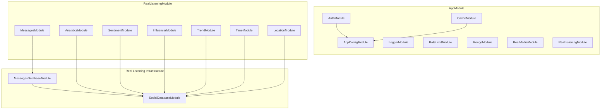

# Module Tree Relation – RealOne (NestJS)

Tree of all NestJS modules and their import/dependency relations. Generated from `src/**/*.module.ts`.

---

## ASCII Tree

```
AppModule
├── AppConfigModule                    # config/ – typed env, no deps
├── AuthModule                         # auth/
│   └── AppConfigModule
├── LoggerModule                       # core/logger/ – @Global, no deps
├── CacheModule                        # @nestjs/cache-manager (async, uses AppConfigModule)
├── RateLimitModule                    # core/rate-limit/ – no deps
├── MongoModule                        # core/database/ – @Global, Mongoose root
├── RealMediaModule                    # modules/real-media/ – no deps
└── RealListeningModule                # modules/real-listening/
    ├── MessagesModule                 # features/messages/
    │   └── MessagesDatabaseModule     # infrastructure/
    │       └── SocialDatabaseModule   # infrastructure/
    │           └── MongooseModule.forFeature(SocialMessage) + SocialQueryBuilderService
    ├── AnalyticsModule                # features/analytics/
    │   └── SocialDatabaseModule
    ├── SentimentModule                # features/sentiment/
    │   └── SocialDatabaseModule
    ├── InfluencerModule               # features/influencer/
    │   └── SocialDatabaseModule
    ├── TrendModule                    # features/trend/
    │   └── SocialDatabaseModule
    ├── TimeModule                     # features/time/
    │   └── SocialDatabaseModule
    └── LocationModule                 # features/location/
        └── SocialDatabaseModule
```

---

## Mermaid Diagram



---

## Flat Module List (by path)

| Path | Module | Imports |
|------|--------|--------|
| `src/app.module.ts` | AppModule | AppConfigModule, AuthModule, LoggerModule, CacheModule, RateLimitModule, MongoModule, RealMediaModule, RealListeningModule |
| `src/config/config.module.ts` | AppConfigModule | ConfigModule.forRoot(...) |
| `src/auth/auth.module.ts` | AuthModule | AppConfigModule, PassportModule, JwtModule |
| `src/core/logger/logger.module.ts` | LoggerModule | — |
| `src/core/rate-limit/rate-limit.module.ts` | RateLimitModule | — |
| `src/core/database/mongo.module.ts` | MongoModule | MongooseModule.forRootAsync(...) |
| `src/modules/real-media/real-media.module.ts` | RealMediaModule | — |
| `src/modules/real-listening/real-listening.module.ts` | RealListeningModule | MessagesModule, AnalyticsModule, SentimentModule, InfluencerModule, TrendModule, TimeModule, LocationModule, RouterModule |
| `src/modules/real-listening/features/messages/messages.module.ts` | MessagesModule | MessagesDatabaseModule |
| `src/modules/real-listening/features/analytics/analytics.module.ts` | AnalyticsModule | SocialDatabaseModule |
| `src/modules/real-listening/features/sentiment/sentiment.module.ts` | SentimentModule | SocialDatabaseModule |
| `src/modules/real-listening/features/influencer/influencer.module.ts` | InfluencerModule | SocialDatabaseModule |
| `src/modules/real-listening/features/trend/trend.module.ts` | TrendModule | SocialDatabaseModule |
| `src/modules/real-listening/features/time/time.module.ts` | TimeModule | SocialDatabaseModule |
| `src/modules/real-listening/features/location/location.module.ts` | LocationModule | SocialDatabaseModule |
| `src/modules/real-listening/infrastructure/messages-database.module.ts` | MessagesDatabaseModule | SocialDatabaseModule |
| `src/modules/real-listening/infrastructure/social-database.module.ts` | SocialDatabaseModule | MongooseModule.forFeature(SocialMessage) |

---

## Route Prefix

- **Real Listening** features are mounted under: `/real-listening/` (via `RouterModule`).
- Each feature exposes its own controller routes (e.g. `/real-listening/analytics/query`, `/real-listening/messages`, etc.).
